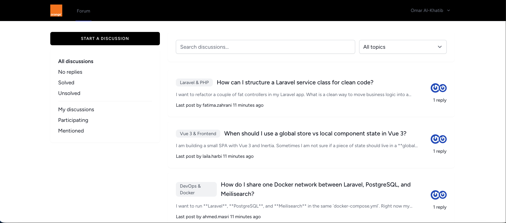
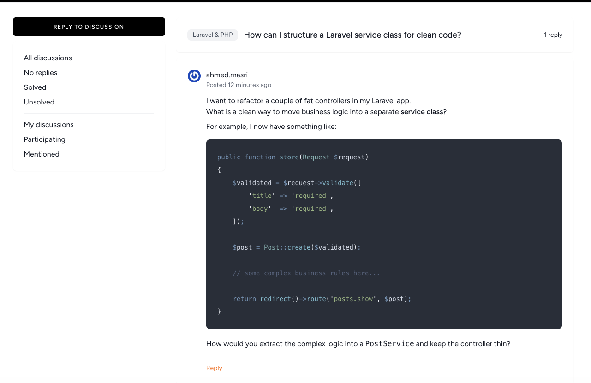
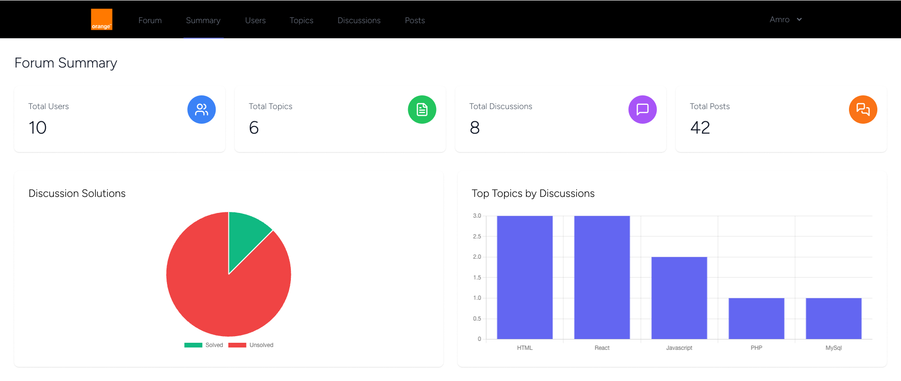

# Orange Mentor

## Table of Contents
- [Description](#description)
- [Motivation](#motivation)
- [Quick Start](#-quick-start)
- [Usage](#usage)
- [Technologies Used](#technologies-used)
  - [Backend](#backend)
  - [Frontend](#frontend)


## Description
A discussion platform like Stack Overflow for Orange Coding Academy students which provides Q&A and knowledge sharing. It supports the markdown format to make the code appear better.






## Motivation
Initially, we used WhatsApp or Discord to share information and ask coches questions, but these platforms have some limitations and are not entirely suitable for programming students. This platform was designed to address this issue.


## 🚀 Quick Start

1. Clone the repository:

```bash
git clone https://github.com/AbdelRahmanAlTamimi/Orange-Mentor.git
cd Oragne-Mentor
```

2. Start the application with Docker Compose:

```bash
docker-compose up -d
```

3. Access the application:
    - Frontend: http://localhost:8000
    - Meilisearch Dashboard: http://localhost:7700

The Docker setup will automatically:

-   Install PHP and JavaScript dependencies
-   Run database migrations
-   Seed the database with demo data
-   Start all required services (PostgreSQL, Meilisearch, Redis)


## Usage
Once the Docker environment is up and running, you can log in with these accounts:

**Admin Account:**

-   Email: `ahmed.masri@example.com`
-   Password: `password`

**User Account:**

-   Email: `omar.khatib@example.com`
-   Password: `password`

then you can use the full features of the website

## Technologies Used

### Backend

-   **Laravel 10** - PHP framework
-   **PostgreSQL** - Database
-   **Meilisearch** - Full-text search engine
-   **Redis** - Caching and session storage
-   **Laravel Sanctum** - API authentication
-   **Laravel Scout** - Search functionality
-   **Spatie Laravel Markdown** - Markdown rendering
-   **Spatie Laravel Query Builder** - API query filtering

### Frontend

-   **Vue 3** - JavaScript framework
-   **Inertia.js** - SPA-like experience without API complexity
-   **Tailwind CSS** - Utility-first CSS framework
-   **Vite** - Build tool and dev server
-   **Shiki** - Syntax highlighting for code blocks
-   **Vue Mention** - User mention functionality